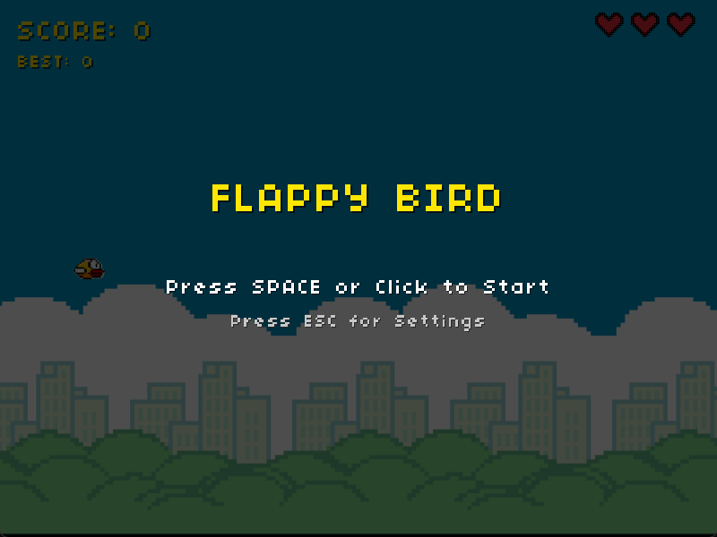

# 🐦 Flappy Bird - C Game Clone


<div align="center">
  


**A modern recreation of the classic Flappy Bird game, built from scratch in C using the Raylib framework.**

[Features](#-features) • [Demo](#-demo) • [Installation](#-installation) • [Controls](#-controls) • [Project Structure](#-project-structure)

---

</div>

## 📸 Demo

<div align="center">

### Main Menu & Game Over
  
| Main Menu | Game Over |
|:---------:|:---------:|
|  |  |

### Gameplay in Action


</div>

## ✨ Features

### 🎮 Core Gameplay
- **Smooth Physics** - Realistic gravity and flapping mechanics
- **Procedural Generation** - Randomly generated pipes for endless gameplay
- **Score Tracking** - Keep track of your best score across sessions
- **Collision Detection** - Precise hit detection system

### 💖 Life System
- **3 Lives** - Get three chances before game over
- **Respawn Countdown** - 3-second countdown timer after losing a life
- **Pixel Art Hearts** - Retro-style heart indicators

### 🎨 Visual Polish
- **Screen Shake** - Impact feedback on collisions
- **Pixel Art Graphics** - Authentic retro aesthetic
- **Custom Fonts** - Supports custom TTF fonts for UI
- **Smooth Animations** - Fluid bird movement and rotation

### ⚙️ Settings & Controls
- **Pause Menu** - Pause anytime during gameplay (ESC or P)
- **Volume Control** - Adjust sound effects volume
- **Screen Shake Toggle** - Enable/disable screen shake effect
- **Persistent Settings** - Settings saved between game sessions

### 🔊 Audio
- **Sound Effects**
  - Wing flap sound
  - Point scoring sound
  - Collision/hit sound
- **Volume Controls** - Adjustable SFX volume

## 🎯 Controls

| Action | Key |
|--------|-----|
| **Flap / Start** | `SPACE` or `LEFT CLICK` |
| **Pause / Resume** | `ESC` or `P` |
| **Settings** | `ESC` (from menu) or `S` (from pause) |
| **Volume Up** | `UP ARROW` (in settings) |
| **Volume Down** | `DOWN ARROW` (in settings) |
| **Toggle Screen Shake** | `T` (in settings) |

## 🛠️ Installation

### Prerequisites
- **C Compiler** (GCC, Clang, MSVC)
- **Raylib** (5.0 or higher)
- **Make** (optional, for building)

### Building from Source

#### Linux/macOS
```bash
# Clone the repository
git clone https://github.com/RM1338/FlappyBird.git
cd FlappyBird

# Install Raylib (if not already installed)
# On Ubuntu/Debian:
sudo apt-get install libraylib-dev

# On macOS (using Homebrew):
brew install raylib

# Compile
gcc src/*.c -o flappy_bird -lraylib -lm

# Run
./flappy_bird
```

#### Windows
```bash
# Clone the repository
git clone https://github.com/RM1338/FlappyBird.git
cd FlappyBird

# Compile (using MinGW)
gcc src/*.c -o flappy_bird.exe -lraylib -lopengl32 -lgdi32 -lwinmm

# Run
flappy_bird.exe
```

### Download Pre-built Binaries
Check the [Releases](https://github.com/RM1338/FlappyBird/releases) page for pre-compiled binaries.

## 📁 Project Structure

```
FlappyBird/
├── assets/
│   ├── bg.png              # Background image (800x600)
│   ├── bird.png            # Bird sprite (27x20)
│   ├── pipe.png            # Pipe texture (80x217)
│   ├── font.ttf            # Custom pixel font
│   └── sounds/
│       ├── flap.wav        # Wing flap sound
│       ├── score.wav       # Score point sound
│       └── hit.wav         # Collision sound
├── src/
│   ├── main.c              # Entry point & game loop
│   ├── game.h              # Game structures & constants
│   ├── game.c              # Core game logic
│   ├── player.h            # Bird/player API
│   └── player.c            # Bird physics & rendering
├── githubAssets/
│   ├── banner.png          # README banner
│   ├── MainMenu.png        # Menu screenshot
│   ├── GameOver.png        # Game over screenshot
│   └── GameDemo.gif        # Gameplay GIF
├── settings.dat            # Saved settings (auto-generated)
└── README.md
```

## 🎨 Customization

### Adding Custom Assets
1. Replace images in `assets/` folder (keep same dimensions)
2. Replace sounds in `assets/sounds/` (WAV format recommended)
3. Add custom font to `assets/font.ttf` (TTF format)

### Tweaking Gameplay
Edit constants in `game.h`:
```c
#define PIPE_SPEED      150.0f    // Pipe scrolling speed
#define PIPE_SPAWN_TIME 2.0f      // Time between pipes
#define MIN_GAP_SIZE    100       // Minimum gap size
#define MAX_GAP_SIZE    160       // Maximum gap size
#define MAX_LIVES       3         // Number of lives
```

## 🐛 Known Issues

- Screen shake may be too intense on some systems (can be disabled in settings)
- Custom fonts require proper TTF files (falls back to default font if missing)

## 🚀 Future Features

- [ ] Leaderboard system
- [ ] Multiple bird skins
- [ ] Day/night cycle
- [ ] Power-ups
- [ ] Different difficulty modes
- [ ] Background music
- [ ] Mobile touch controls

## 📝 License

This project is licensed under the MIT License - see the [LICENSE](LICENSE) file for details.

## 🙏 Acknowledgments

- **Raylib** - Amazing game framework by [Ramon Santamaria](https://github.com/raysan5)
- **Original Flappy Bird** - Created by Dong Nguyen
- **Pixel Fonts** - [dafont.com](https://www.dafont.com)

## 📧 Contact

**Ronel Abraham Mathew** - [@RM1338](https://www.linkedin.com/in/ronelm/)

Project Link: [https://github.com/RM1338/FlappyBird](https://github.com/RM1338/FlappyBird)

---

<div align="center">
  
Made with ❤️ and lots of ☕

If you found this project helpful, consider giving it a ⭐!

</div>
